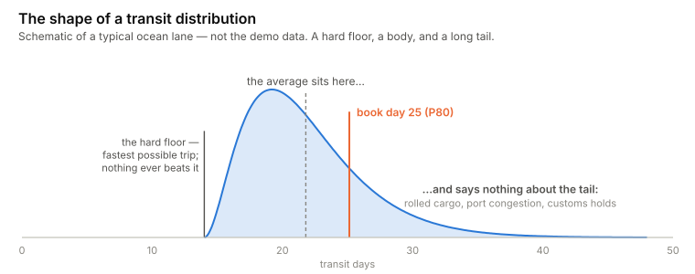
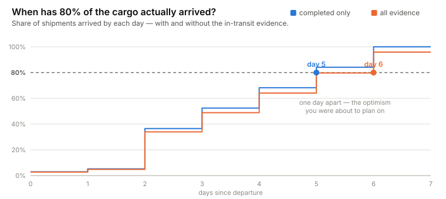
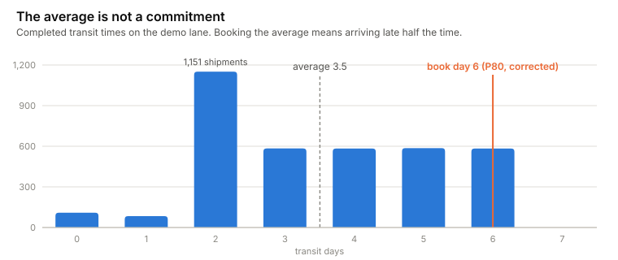
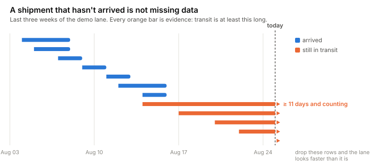

# lane-forecast

[](https://github.com/rikardotoro/lane-forecast/actions/workflows/ci.yml)

**Your carrier says 21 days. Plan for 21 and you'll be late 6 times in 10.**

A carrier ETA is roughly a median: half of shipments beat it, half don't. If your
replenishment plan books against it, every shipment in the slow half arrives after
the date your plan promised. This tool reads your shipment history and tells you
the transit day to actually book against — the percentile that matches the
reliability you want — and it does it without silently throwing away the
shipments that are still at sea.

<picture>
  <source media="(prefers-color-scheme: dark)" srcset="docs/charts/skew-dark.svg">
  
</picture>

## The 30-second version

```bash
uvx --from git+https://github.com/rikardotoro/lane-forecast lane-forecast --demo
```

<!-- BEGIN OUTPUT -->
```
Transit days — CNSHA to USA              
┏━━━━━━━━━━━━┳━━━━━━━━━━━━━━━━┳━━━━━━━━━━━━━━━━━━━━━━┓
┃ Percentile ┃ Completed only ┃ Including in-transit ┃
┡━━━━━━━━━━━━╇━━━━━━━━━━━━━━━━╇━━━━━━━━━━━━━━━━━━━━━━┩
│ P10        │            2.0 │                  2.0 │
│ P50        │            3.0 │                  4.0 │
│ P80        │            5.0 │                  6.0 │
│ P90        │            6.0 │                  6.0 │
└────────────┴────────────────┴──────────────────────┘

Plan for day 6 to be right 80% of the time.

4000 shipments, of which 320 still in transit.
Carrier ETA runs +0.6 days optimistic.
Two clusters detected — likely rolled cargo. A single percentile hides this.
```
<!-- END OUTPUT -->

The two columns are the whole argument. "Completed only" is what you get from any
percentile formula over arrived shipments. "Including in-transit" is what you get
when the shipments still moving are counted as evidence. The corrected number is
never lower — and the gap is exactly the optimism you were about to plan on.

<picture>
  <source media="(prefers-color-scheme: dark)" srcset="docs/charts/percentiles-dark.svg">
  
</picture>

## Why the average is the wrong number

Three problems, in increasing order of subtlety:

1. **The average is not a commitment.** In the demo data the mean transit is about
   3.5 days, but planning for day 4 (the corrected median) still means being late
   half the time. Reliability lives in the tail: to be right 8 times out of 10 you
   book against the P80 — day 6 in the demo, two full days above the median.

<picture>
  <source media="(prefers-color-scheme: dark)" srcset="docs/charts/histogram-dark.svg">
  
</picture>

2. **Transit distributions are skewed.** There is a hard floor (the fastest
   physically possible trip) and a long tail (rolled cargo, port congestion,
   customs holds). The mean sits below the tail and tells you nothing about it —
   the shape is the curve at the top of this page.

3. **The shipments still at sea are evidence, not missing data.** A shipment that
   departed 14 days ago and hasn't arrived tells you *the transit is at least 14
   days* — and throwing it away makes you look faster than you are. Slow shipments
   are overrepresented among the in-transit precisely because they're slow; drop
   them and every percentile you compute is biased optimistic. In the demo, adding
   the 320 in-transit shipments moves the P80 from 5 to 6 days. This tool handles
   them with the Kaplan–Meier estimator, the standard survival-analysis method for
   exactly this censoring problem.

<picture>
  <source media="(prefers-color-scheme: dark)" srcset="docs/charts/timeline-dark.svg">
  
</picture>

## Do this in your own tools

You don't need this tool to stop planning on the average. Percentiles are one
function away in whatever you already use:

**Excel**

```
=PERCENTILE.INC(transit_days_range, 0.8)
```

Filter transshipment legs out first — mixing them with direct sailings blends two
different distributions and the percentile describes neither.

**Power BI (DAX)**

```
P80 Transit = PERCENTILEX.INC(Shipments, Shipments[TransitDays], 0.8)
```

**SQL**

```sql
SELECT PERCENTILE_CONT(0.8) WITHIN GROUP (ORDER BY transit_days)
FROM shipments
WHERE origin = 'CNSHA' AND destination = 'USA';
```

None of these handle in-transit shipments — they only see rows with an arrival
date, which is the optimistic bias described above. That correction is the one
thing this tool adds.

## Four ways to get this wrong

Each of these is a real mistake seen in real planning sheets, and each one has a
test in this repo proving the failure mode:

1. **Dropping in-transit shipments.** The estimate goes optimistic exactly when
   the lane is degrading — the moment you most need the truth.
   → [`tests/test_censoring.py::test_censored_rows_push_p80_above_the_naive_estimate`](tests/test_censoring.py)

2. **Mixing transshipment with direct.** Two routings, two distributions, one
   meaningless blended percentile. The tool reports the split so you can analyse
   them separately.
   → [`tests/test_diagnostics.py::test_transshipment_split_counts_groups`](tests/test_diagnostics.py)

3. **Ignoring Chinese New Year.** Departures in the weeks around CNY (and Golden
   Week) live in a different distribution. If a big share of your history sits in
   a peak window, your percentile is a seasonal artifact.
   → [`tests/test_diagnostics.py::test_peak_season_share_counts_chinese_new_year_departures`](tests/test_diagnostics.py)

4. **Reporting a point ETA instead of a range.** A single number hides everything
   this README is about. The output table *is* the fix: a spread of percentiles,
   so the conversation becomes "how sure do we need to be?" instead of "what's
   the ETA?".

## Run it

```bash
uvx --from git+https://github.com/rikardotoro/lane-forecast lane-forecast --demo
uvx --from git+https://github.com/rikardotoro/lane-forecast lane-forecast \
  --data shipments.csv --lane CNSHA-NLRTM --service-level 0.9
```

Input is a CSV with these columns (names are auto-detected from common aliases
like `POL`/`POD`/`ATD`/`ATA`; force any mapping with `--map`):

| Column | Required | Meaning |
|---|---|---|
| `origin` | yes | Lane origin (port/location code) |
| `destination` | yes | Lane destination |
| `carrier` | yes | Carrier or service |
| `departure` | yes | Actual departure date |
| `arrival` | no | Actual arrival date — leave empty for shipments still in transit |
| `transshipment` | no | Whether the routing transships |
| `carrier_eta` | no | What the carrier promised, to measure its bias |

```bash
lane-forecast --data export.csv --lane CNSHA-NLRTM --map departure=gate_out --map arrival=pod_ata
lane-forecast --data export.csv --lane CNSHA-NLRTM --json   # machine-readable
```

## What this doesn't do

- **It does not predict a specific shipment.** It describes the lane's
  distribution; your container is one draw from it.
- **It needs history — about 30 shipments per lane** before it will give you a
  number (lower the bar at your own risk with `--min-shipments`).
- **It will not extrapolate** to a lane you've never shipped. No history, no
  estimate, no apology.
- **The demo data is order-delivery data, not ocean transit.** It's a CC0 public
  dataset reshaped to the tool's schema (see [examples/SOURCE.md](src/lane_forecast/examples/SOURCE.md));
  it proves the method on real promised-versus-actual figures, not sea-lane
  performance.

## Is any of this actually tested?

All of it. Every claim in this README is enforced by a test — each trap in
"Four ways to get this wrong" links to the test that proves it, and the demo
output above is generated by running the tool, never pasted in. The suite runs
in CI on every push, against Python 3.11 and 3.12 (that's the badge at the top).
The test names below are the README's argument, restated as executable proof.

<details>
<summary><strong>The full test list</strong> — regenerated by <code>scripts/render_readme_output.py</code>, so it can't drift</summary>

<!-- BEGIN TESTS -->
```
40 passed

tests/test_censoring.py::test_survival_starts_at_one_and_decreases PASSED
tests/test_censoring.py::test_with_no_censoring_km_matches_empirical PASSED
tests/test_censoring.py::test_censored_rows_push_p80_above_the_naive_estimate PASSED
tests/test_censoring.py::test_all_censored_refuses_to_estimate PASSED
tests/test_censoring.py::test_unreachable_quantile_returns_none PASSED
tests/test_cli.py::test_cli_runs_and_reports PASSED
tests/test_cli.py::test_cli_json_output_is_valid PASSED
tests/test_cli.py::test_unknown_lane_lists_available_lanes PASSED
tests/test_data.py::test_detects_canonical_names PASSED
tests/test_data.py::test_detects_common_aliases PASSED
tests/test_data.py::test_override_beats_detection PASSED
tests/test_data.py::test_missing_required_column_names_the_column PASSED
tests/test_data.py::test_optional_columns_absent_is_fine PASSED
tests/test_data.py::test_load_returns_canonical_columns PASSED
tests/test_data.py::test_unparseable_date_names_the_row PASSED
tests/test_data.py::test_arrival_before_departure_is_rejected PASSED
tests/test_demo_data.py::test_demo_file_is_small PASSED
tests/test_demo_data.py::test_demo_file_loads_and_has_censored_rows PASSED
tests/test_diagnostics.py::test_carrier_eta_bias_is_positive_when_late PASSED
tests/test_diagnostics.py::test_carrier_eta_bias_is_none_without_the_column PASSED
tests/test_diagnostics.py::test_transshipment_split_counts_groups PASSED
tests/test_diagnostics.py::test_unimodal_is_not_flagged PASSED
tests/test_diagnostics.py::test_bimodal_is_flagged PASSED
tests/test_diagnostics.py::test_peak_season_share_counts_chinese_new_year_departures PASSED
tests/test_quantiles.py::test_quantiles_of_a_known_sequence PASSED
tests/test_quantiles.py::test_default_levels_are_returned PASSED
tests/test_quantiles.py::test_p80_is_at_least_p50 PASSED
tests/test_quantiles.py::test_too_few_observations_raises PASSED
tests/test_quantiles.py::test_min_observations_can_be_lowered PASSED
tests/test_report.py::test_analysis_counts_censored_rows PASSED
tests/test_report.py::test_to_dict_is_json_serialisable PASSED
tests/test_smoke.py::test_version_is_exposed PASSED
tests/test_smoke.py::test_missing_column_error_is_a_lane_forecast_error PASSED
tests/test_transit.py::test_completed_shipment_transit_days PASSED
tests/test_transit.py::test_in_flight_shipment_is_censored_at_as_of PASSED
tests/test_transit.py::test_as_of_defaults_to_latest_date_in_data PASSED
tests/test_transit.py::test_missing_arrival_column_means_all_censored PASSED
tests/test_transit.py::test_filter_lane_selects_origin_and_destination PASSED
tests/test_transit.py::test_filter_lane_is_case_insensitive PASSED
tests/test_transit.py::test_filter_lane_with_carrier PASSED
```
<!-- END TESTS -->

</details>

## Licence

MIT.
